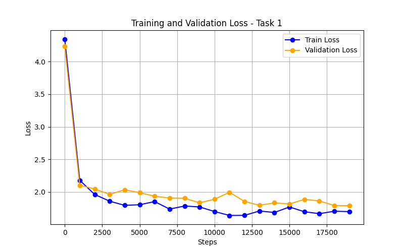

# Task 1 — Build Your Own GPT (The Glorified Autocomplete)

In this task I built a small GPT-2 style transformer from scratch using PyTorch and trained it on the Tiny Shakespeare dataset. The goal was to make the model autocomplete text in a Shakespeare-like style.

---


## What I Built

- A character-level tokenizer that converts text into numbers and back
- A decoder-only transformer with masked self-attention
- A training loop using Cross-Entropy Loss
- A text generation script that samples from the model

---


## Files

| File | What it does |
|---|---|
| `dataset.py` | Loads input.txt, tokenizes it, and provides batches for training |
| `model.py` | Full transformer architecture (embeddings, attention, feedforward, blocks) |
| `train.py` | Training loop — trains the model and saves weights to model.pth |
| `generate.py` | Loads the saved model and generates new Shakespeare-like text |
| `plot_loss.py` | Plots the training and validation loss curve |

---


## Model Architecture

|Setting|Value|
|---|---|
| Embedding size | 64 |
| Context length (block size) | 32 |
| Number of attention heads | 4 |
| Head size | 16 |
| Number of transformer blocks | 3 |
| Feed-forward inner size | 256 (4x expansion) |
| Activation | GELU |
| Dropout | 0.2 |
| Total parameters | ~400K |

---


## Hyperparameters

|Setting|Value|
|---|---|
| Optimizer | AdamW |
| Learning rate | 1e-3 |
| Batch size | 32 |
| Training steps | 20,000 |
| Gradient clipping | 1.0 |

---


## Training Loss Curve

> Run `plot_loss.py` after training to generate this image.



---


## How to Run

**Step 1 — Train the model**
```bash
python train.py
```

**Step 2 — Generate text**
```bash
python generate.py
```

**Step 3 — Plot the loss curve**
```bash
python plot_loss.py
```

---

## Sample output
LUCENTIO:
I am then bear?
Whear issure to-more remans and press, which as is as we not be being them live, our scarrible possions resent her stand,
The worship sar?

EMENENIUS:
So grumenty means I speak they are
suck is thy tetterish time soldier.

MARCIUS:
The safe rewith mong: my die words he is that move you.

AUFIDIUS:
Go Gave I am you mall stand let
And prover throther with the farment with thy pasts meet
These ears in other man, like of with our armenter!

BRUTUS:
No safe no son; go on't my obsence,
He grace and commons and kind, by hast our live mother base,
In will the raor in speak and fair more here,
Provost repet enders, my on 'Twas it endsemin:
My grief wonder be a forth; will for the care pirth the come friends.

POMPEY:
Shall be mother?

KING RICHARD IIII:
I have king her haste-repant of my leave more.

QUEEN MARGARET:
Look not you shall and thy defect same, since the and heart.

DUKE VINCENTIO:
I can my Loons the beging, for heads;
And thy abse in the duke to the trase

---

## What I Learned

- How transformer attention works from scratch
- Why we need a causal mask (so the model cannot cheat by looking at future tokens)
- What skip connections and layer norm do for training stability
- How temperature affects the randomness of generated text
