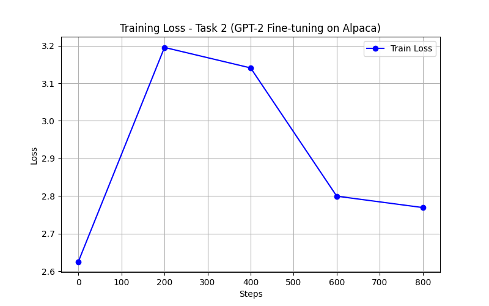

# Task 2 — Supervised Fine-Tuning of GPT-2 on Alpaca

In this task I took the pretrained GPT-2 model (124M parameters) and fine-tuned it on the Stanford Alpaca dataset so it can follow instructions and have a basic conversation. This is the step that turns a "glorified autocomplete" into something that actually responds to questions.

---


## What I Built
- A dataset loader that downloads the Alpaca dataset and formats each example into the Alpaca prompt template
- A fine-tuning loop using Cross-Entropy Loss with label masking (only the response part contributes to the loss)
- An inference script that loads the saved model and runs a chatbot loop

---


## Files

|Files|What it does|
|---|---|
| `dataset.py` | Loads the Alpaca dataset and formats prompts using the Alpaca template |
| `train.py` | Fine-tunes GPT-2 on the formatted dataset and saves the model |
| `Inference.py` | Loads the saved model and lets you chat with it |
| `plot_loss.py` | Plots the training loss curve |

---


## Prompt Template

I used the standard Alpaca prompt format. The exact same template is used in both training and inference — using different templates in each place is a bug that causes the model to produce bad outputs.

```
### Instruction:
{instruction}

### Input:
{input}        ← only included if there is extra context

### Response:
{output}       ← the model learns to generate this part
```

---

## Hyperparameters

|Settign|Value|
|---|---|
| Base model | openai-community/gpt2 (124M) |
| Dataset | tatsu-lab/alpaca (1500 samples, CPU-friendly subset) |
| Optimizer | AdamW |
| Learning rate | 3e-5 |
| Batch size | 4 |
| Epochs | 1 |
| Max sequence length | 64 |
| Gradient clipping | 1.0 |

---


## Key Design Decision — Label Masking

Normal language model training computes loss on every single token. But for instruction fine-tuning, we only want the model to learn how to write the *response*, not memorize the instruction.

So in `train.py`, I set the labels for all instruction tokens to `-100`. PyTorch automatically skips `-100` labels when computing cross-entropy loss. This means the model only gets trained on the response portion.

```
### Instruction:          ← labels = -100 (ignored in loss)
What is gravity?          ← labels = -100 (ignored in loss)
### Response:             ← labels = -100 (ignored in loss)
Gravity is a force...    ← labels = real token ids (model learns this)
```

---

## Training Loss Curve

> Run `plot_loss.py` after training to generate this image.



---


## How to Run

**Step 1 — Install dependencies**
```bash
pip install torch transformers datasets
```

**Step 2 — Train the model**
```bash
python train.py
```

This will download GPT-2 and the Alpaca dataset automatically and save the fine-tuned model to a folder called `my_model/`.


**Step 3 — Chat with the model**
```bash
python Inference.py
```

**Step 4 — Plot the loss curve**
```bash
python plot_loss.py
```

---


## Sample Conversation

```
You: What is machine learning 
Bot: Machine Learning (ML) refers to artificial intelligence or AI that can be used in a variety of applications. It has been studied extensively for its ability at understanding human behavior and making decisions, such as how cars are driving themselves while on the road, which food choices people make during their travels, what types foods they eat before meals, who walks around with them when walking down streets, whether animals roam freely between buildings, etc., among other tasks.[1] ML programs use algorithms designed specifically for specific functions

You: what is gravity 
Bot: gravity, which in turn includes gravitational waves and other electromagnetic fields. Gravity can be measured by measuring how much force a given object exerts on it or what direction the energy source moves through its field of view as well (or vice versa). This ability to measure forces has been used for many years around galaxies such that their masses are comparable with those found at Earth's surface; however when applied to large scale objects like planets orbiting our solar system, this method may not provide enough data from orbiters due

You: what is a neural network
Bot: a computer program that uses learning algorithms to learn and adapt an individual's behavior. It can then predict what type of response will occur, how well it'll handle the information in future situations or provide insights into patterns such as past actions (such Asperger Syndrome). Neural networks are typically used for tasks like social media analytics where users may collect data about individuals' habits through their own online profiles; however they're often more useful when using artificial intelligence than other types on-demand services due partly because these
```

---


## Limitations

- Trained on only 500 examples due to CPU constraints (full dataset has 52,000)
- Only 1 epochs of training — more epochs would improve the responses
- Max sequence length of 64 tokens — long instructions may get cut off

---


## What I Learned

- How transfer learning works — starting from a pretrained model is much better than training from scratch
- Why label masking matters in SFT — without it, the model wastes capacity trying to predict the instruction
- How the Alpaca prompt format structures instruction-following data
- How temperature, top-k, and top-p sampling affect the quality of generated responses
